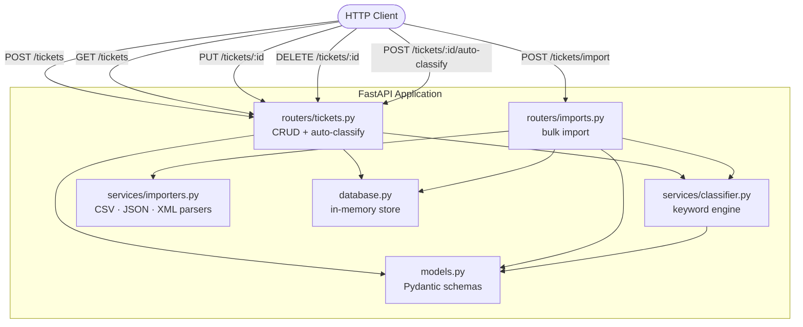

# Intelligent Customer Support System

A FastAPI-based REST service that ingests support tickets from CSV, JSON, and XML files, validates them with Pydantic, and automatically categorises and prioritises each ticket using a rule-based keyword classifier.

---

## Features

- **Multi-format bulk import** — upload CSV, JSON, or XML; receive a per-row success/failure summary
- **Full CRUD API** — create, read, update, and delete individual tickets
- **Auto-classification** — keyword-driven engine assigns category and priority with a confidence score
- **Filtering** — list tickets by `category`, `priority`, `status`, or `customer_id`
- **Manual override** — re-classify or lock a ticket's classification at any time
- **Structured validation** — Pydantic v2 models enforce email format, enum values, and string-length constraints
- **Comprehensive test suite** — 56 tests across unit, integration, and performance layers (>85 % coverage target)

---

## Architecture



### Component overview

| Component | Responsibility |
|-----------|---------------|
| `main.py` | FastAPI app factory; registers routers and logging |
| `routers/tickets.py` | CRUD endpoints and the `POST /{id}/auto-classify` action |
| `routers/imports.py` | `POST /tickets/import`; resolves parser, validates rows, writes to store |
| `services/classifier.py` | Keyword-based category/priority scorer; returns `ClassificationResult` |
| `services/importers.py` | Stateless parsers that convert raw file content to `list[dict]` |
| `models.py` | All Pydantic models: `Ticket`, `TicketCreate`, `TicketUpdate`, `ImportSummary`, … |
| `database.py` | Thread-safe in-memory `TicketStore` (dictionary-backed) |

---

## Project structure

```
homework-2/
├── README.md
├── TASKS.md
├── .gitignore
├── run_server.sh              ← start server + load seed data
├── run_tests.sh               ← test runner script (coverage report)
├── coverage.xml               ← generated after running run_tests.sh
├── demo/
│   └── seed_data.json         ← 15 sample tickets (all categories & priorities)
├── docs/
│   ├── API_REFERENCE.md
│   ├── ARCHITECTURE.md
│   ├── TESTING_GUIDE.md
│   └── screenshots/           ← test_coverage.png and AI prompt screenshots
├── ui/                        ← React + Vite frontend (bonus)
│   ├── src/
│   │   ├── api/client.ts
│   │   ├── components/
│   │   ├── hooks/
│   │   ├── pages/
│   │   └── types/
│   ├── package.json
│   └── vite.config.ts
└── src/
    ├── main.py
    ├── database.py
    ├── models.py
    ├── requirements.txt
    ├── htmlcov/               ← generated HTML coverage report
    ├── routers/
    │   ├── __init__.py
    │   ├── imports.py
    │   └── tickets.py
    ├── services/
    │   ├── __init__.py
    │   ├── classifier.py
    │   └── importers.py
    └── tests/
        ├── conftest.py
        ├── test_ticket_api.py
        ├── test_ticket_model.py
        ├── test_import_csv.py
        ├── test_import_json.py
        ├── test_import_xml.py
        ├── test_categorization.py
        ├── test_integration.py
        ├── test_performance.py
        └── fixtures/
            ├── sample_tickets.csv      (50 rows)
            ├── sample_tickets.json     (20 objects)
            ├── sample_tickets.xml      (30 elements)
            ├── invalid_tickets.csv     (negative test data)
            ├── invalid_tickets.json    (negative test data)
            └── invalid_tickets.xml     (negative test data)
```

---

## Installation and setup

### Prerequisites

- Python 3.11 or later
- `pip` (bundled with Python)

### 1 — Clone the repository

```bash
git clone <repo-url>
cd gen-ai-software-engineering/homework-2
```

### 2 — Create and activate a virtual environment

```bash
python -m venv .venv
source .venv/bin/activate        # macOS / Linux
# .venv\Scripts\activate         # Windows
```

### 3 — Install dependencies

```bash
pip install -r src/requirements.txt
```

### 4 — Run the development server

**Option A — with sample data (recommended for first run)**

```bash
# From homework-2/
./run_server.sh
```

The script starts the server, waits for it to be ready, then loads 15 demo tickets covering all categories and priorities. It prints a breakdown of what was seeded and shows the Swagger URL.

```bash
./run_server.sh --no-seed      # server only, no sample data
./run_server.sh --seed-only    # load data into an already-running server
./run_server.sh --port 9000    # custom port (default: 8000)
```

**Option B — plain uvicorn**

```bash
cd src
uvicorn main:app --reload
```

The API is now available at `http://127.0.0.1:8000`.  
Interactive docs: `http://127.0.0.1:8000/docs` (Swagger UI) or `/redoc`.

---

## API endpoints at a glance

| Method | Path | Description |
|--------|------|-------------|
| `GET` | `/health` | Health check |
| `POST` | `/tickets` | Create a ticket (optional `auto_classify` flag) |
| `GET` | `/tickets` | List tickets with optional filters |
| `GET` | `/tickets/{id}` | Fetch a single ticket |
| `PUT` | `/tickets/{id}` | Update a ticket |
| `DELETE` | `/tickets/{id}` | Delete a ticket |
| `POST` | `/tickets/{id}/auto-classify` | Run or re-run the classifier |
| `POST` | `/tickets/import` | Bulk-import from CSV / JSON / XML |

### Auto-classification rules

**Category** — determined by keyword frequency across `subject` + `description`:

| Category | Example keywords |
|----------|-----------------|
| `account_access` | login, password, 2fa, locked out |
| `technical_issue` | error, crash, timeout, not loading |
| `billing_question` | invoice, refund, subscription, pricing |
| `feature_request` | suggestion, enhance, please add, wishlist |
| `bug_report` | steps to reproduce, regression, workaround |
| `other` | fallback when no keywords match |

**Priority** — evaluated in descending order (first match wins):

| Priority | Trigger keywords |
|----------|----------------|
| `urgent` | critical, production down, security, outage |
| `high` | blocking, asap, important, multiple users |
| `low` | minor, cosmetic, suggestion, no rush |
| `medium` | default — no priority keywords matched |

---

## How to run tests

### Quick start — test runner script (recommended)

The `run_tests.sh` script at the project root runs the full suite, enforces ≥ 85 % coverage, and writes three report formats automatically.

```bash
# From homework-2/
./run_tests.sh              # full suite + HTML + XML + terminal coverage
./run_tests.sh --fast       # skip performance tests
./run_tests.sh --unit       # unit tests only (no integration/performance)
./run_tests.sh --file test_ticket_api.py   # single file
```

Reports are written to:
- **Terminal** — printed inline during the run
- **HTML** — `src/htmlcov/index.html` (open in any browser)
- **XML** — `coverage.xml` (CI-compatible Cobertura format)

### Manual pytest commands

All commands assume you are inside the `src/` directory with the virtual environment active.

```bash
# Full suite
cd src && pytest ../src/tests

# With terminal coverage
pytest --cov=. --cov-report=term-missing ../src/tests

# Specific file
pytest tests/test_ticket_api.py -v
pytest tests/test_categorization.py -v
pytest tests/test_integration.py -v

# Exclude performance
pytest --ignore=tests/test_performance.py -v ../src/tests
```

### Test suite breakdown

| File | Area | Tests |
|------|------|------:|
| `test_ticket_api.py` | API endpoints (CRUD + classify) | 11 |
| `test_ticket_model.py` | Pydantic validation | 9 |
| `test_import_csv.py` | CSV parsing | 6 |
| `test_import_json.py` | JSON parsing | 6 |
| `test_import_xml.py` | XML parsing | 6 |
| `test_categorization.py` | Classifier logic | 10 |
| `test_integration.py` | End-to-end workflows | 5 |
| `test_performance.py` | Throughput benchmarks | 5 |
| **Total** | | **58** |

### Performance thresholds

| Benchmark | SLA |
|-----------|-----|
| 100 sequential `POST /tickets` | < 1 s |
| `GET /tickets` with 1 000 records | < 500 ms |
| Import 50-row CSV | < 2 s |
| Classify 1 000 tickets directly | < 1 s |
| 20 concurrent `POST /tickets` | all 201, no corruption |

---

## Dependencies

| Package | Version | Purpose |
|---------|---------|---------|
| `fastapi` | 0.115.5 | Web framework |
| `uvicorn[standard]` | 0.32.1 | ASGI server |
| `pydantic[email]` | 2.10.3 | Data validation and serialisation |
| `python-multipart` | 0.0.18 | File upload support |
| `lxml` | 5.3.0 | XML parsing |
| `httpx` | 0.28.1 | Async HTTP client (used in tests) |
| `pytest` | 8.3.4 | Test runner |
| `pytest-cov` | 6.0.0 | Coverage reporting |
