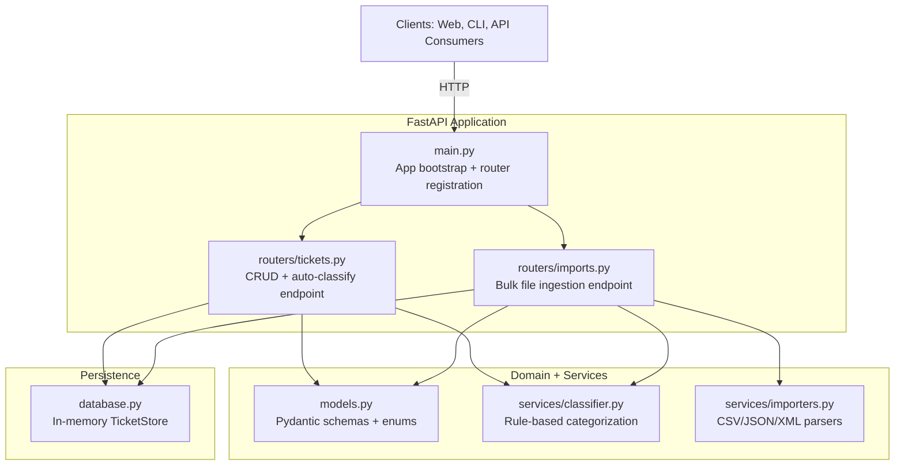
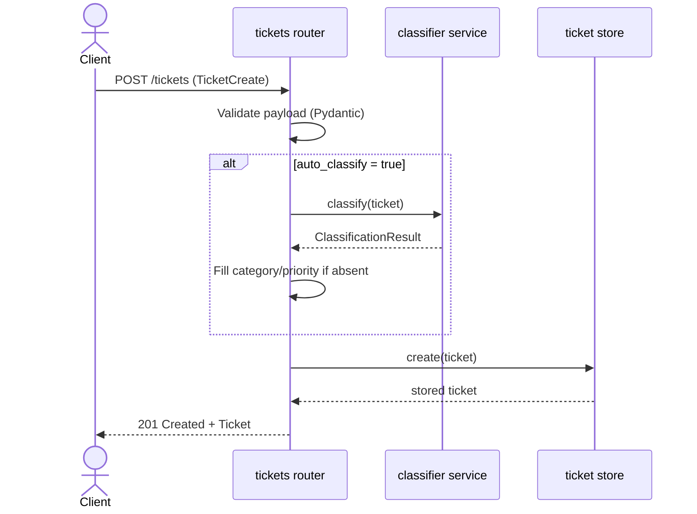

# Architecture Guide

Audience: Technical Leads

## High-Level Architecture



## Component Descriptions

| Component | Responsibility | Notes |
|---|---|---|
| `main.py` | Creates FastAPI app, health endpoint, registers routers | Import router is registered before ticket router to avoid route collision between `/tickets/import` and `/tickets/{ticket_id}` |
| `routers/tickets.py` | Ticket CRUD, filter listing, `POST /tickets/{id}/auto-classify` | Coordinates request validation, classification and store operations |
| `routers/imports.py` | `POST /tickets/import` for CSV, JSON, XML | Resolves parser by content type/extension, validates each row, returns summary with per-row errors |
| `services/classifier.py` | Keyword-based category and priority scoring | Returns `ClassificationResult` with confidence, matched keywords, and reasoning |
| `services/importers.py` | Format-specific parsers returning normalized dictionaries | Kept stateless for testability and isolated parsing concerns |
| `models.py` | Core API/domain contracts and validations | Enforces enums, subject/description bounds, and email validation |
| `database.py` | In-memory ticket persistence (`TicketStore`) | Process-local dictionary store; no external DB dependency |

## Data Flow Diagrams

### Flow 1: Create Ticket with Optional Auto-Classification



### Flow 2: Bulk Import with Per-Row Validation

```mermaid
sequenceDiagram
    actor Client
    participant API as imports router
    participant PAR as parser (csv/json/xml)
    participant CL as classifier service
    participant DB as ticket store

    Client->>API: POST /tickets/import (file, auto_classify?)
    API->>API: Decode file bytes (UTF-8)
    API->>PAR: parse(content)
    PAR-->>API: list[dict] rows
    loop for each row
        API->>API: Build TicketCreate + validate
        alt valid row
            opt auto_classify = true
                API->>CL: classify(ticket)
                CL-->>API: ClassificationResult
            end
            API->>DB: create(ticket)
        else invalid row
            API->>API: Append row error to summary
        end
    end
    API-->>Client: 200 ImportSummary(total, successful, failed, errors)
```

## Design Decisions and Trade-Offs

- **FastAPI + Pydantic chosen for speed of delivery and strict contracts**
  - Pros: clear schemas, built-in validation/errors, OpenAPI docs by default
  - Trade-off: tight coupling to Python ecosystem and runtime model
- **Rule-based classifier instead of ML model**
  - Pros: deterministic, explainable, no model serving dependency
  - Trade-off: keyword maintenance overhead and lower semantic accuracy on novel text
- **In-memory store (`TicketStore`) instead of persistent DB**
  - Pros: simple setup, fast local/test runs, minimal operational complexity
  - Trade-off: no durability across restarts, single-process scope, limited horizontal scale
- **Router/service separation**
  - Pros: clearer boundaries, easier testing, straightforward extension path
  - Trade-off: some duplicate object-mapping code between routers and models
- **Synchronous CRUD handlers + async import endpoint**
  - Pros: pragmatic fit for current workload and endpoint behavior
  - Trade-off: concurrency model is basic; high-throughput workloads would need deeper async/data-layer strategy

## Security and Performance Considerations

### Security

- Input validation is enforced through Pydantic schemas and enums (`models.py`)
- Email and field constraint checks reduce malformed/invalid payload propagation
- Import endpoint limits accepted formats to CSV/JSON/XML and rejects unsupported types
- File decoding failures are handled with explicit 400 responses
- No authentication/authorization is implemented yet; API should not be exposed publicly without an auth layer
- In-memory storage is process-local and unencrypted; avoid storing sensitive production data in this implementation

### Performance

- `TicketStore` operations are O(1) for create/get/update/delete, and O(n) for list filtering
- Classifier runtime scales with text length and keyword list size; suitable for current scope
- Import processing validates rows independently, allowing partial success and reducing full-batch failure impact
- Current performance tests exist but are intentionally skipped (`test_performance.py`), so benchmark thresholds are target SLAs rather than continuously enforced measurements
