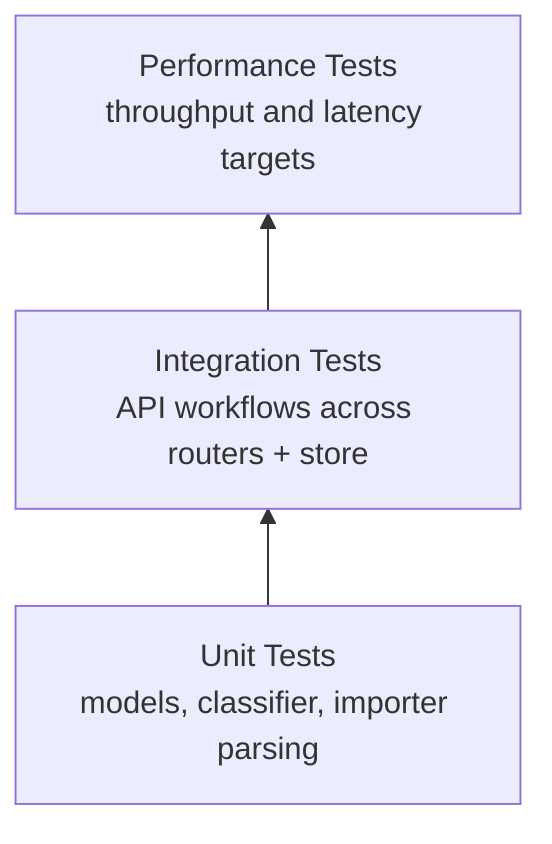

# Testing Guide

Audience: QA Engineers

## Test Pyramid



## How to Run Tests

All commands assume you are at repository root: `homework-2/`.

1. Create and activate a virtual environment:

```bash
python -m venv .venv
source .venv/bin/activate
```

2. Install dependencies:

```bash
pip install -r src/requirements.txt
```

3. Run the complete test suite:

```bash
cd src
pytest tests -v
```

4. Run test categories selectively:

```bash
# Unit-style suites
pytest tests/test_ticket_model.py tests/test_categorization.py tests/test_import_csv.py -v

# API and integration behavior
pytest tests/test_ticket_api.py tests/test_integration.py -v

# Performance suite (currently marked skip in code)
pytest tests/test_performance.py -v
```

5. Run with coverage:

```bash
pytest tests --cov=. --cov-report=term-missing
```

## Sample Test Data Locations

- CSV sample: `src/tests/fixtures/sample_tickets.csv`
- JSON sample: `src/tests/fixtures/sample_tickets.json`
- XML sample: `src/tests/fixtures/sample_tickets.xml`

Usage notes:

- These fixtures are representative positive datasets for import and integration tests
- Negative scenarios (malformed payloads, invalid enums/emails) are currently covered mostly inline inside test cases

## Manual Testing Checklist

Use this list when validating behavior in Swagger UI (`/docs`) or with API client scripts.

- Verify health endpoint: `GET /health` returns `{"status":"ok"}`
- Create ticket with minimum valid payload and confirm `201` response
- Create ticket with `auto_classify=true` and confirm `category`, `priority`, `classification` fields are present
- Get ticket by ID after creation and verify persisted values
- Update ticket status (for example `new` to `in_progress`) and verify `updated_at` changes
- Delete ticket and confirm subsequent `GET /tickets/{id}` returns `404`
- List tickets with filters (`category`, `priority`, `status`, `customer_id`) and verify subset correctness
- Trigger `POST /tickets/{id}/auto-classify` with `override=true` and confirm fields are recalculated
- Import valid CSV/JSON/XML files and verify `successful`, `failed`, and `errors` counters
- Import malformed or unsupported files and verify clean `400` error responses with informative details

## Performance Benchmarks

The table below defines expected SLA thresholds from planned performance scenarios.

| Benchmark | Target Threshold | Source Scenario |
|---|---:|---|
| Create 100 sequential tickets (`POST /tickets`) | < 1.0 s total | `test_create_100_tickets_under_1s` |
| List tickets with 1000 records (`GET /tickets`) | < 500 ms | `test_list_1000_tickets_under_500ms` |
| Import 50-row CSV (`POST /tickets/import`) | < 2.0 s total | `test_csv_import_50_rows_under_2s` |
| Classify 1000 tickets via service call | < 1.0 s total | `test_classify_1000_tickets_under_1s` |
| 20 concurrent ticket creations | 20 successful `201` responses, no corruption | `test_concurrent_20_creates` |

Current status: performance tests are intentionally skipped in `src/tests/test_performance.py`, so treat these values as target benchmarks until the suite is enabled in CI.
